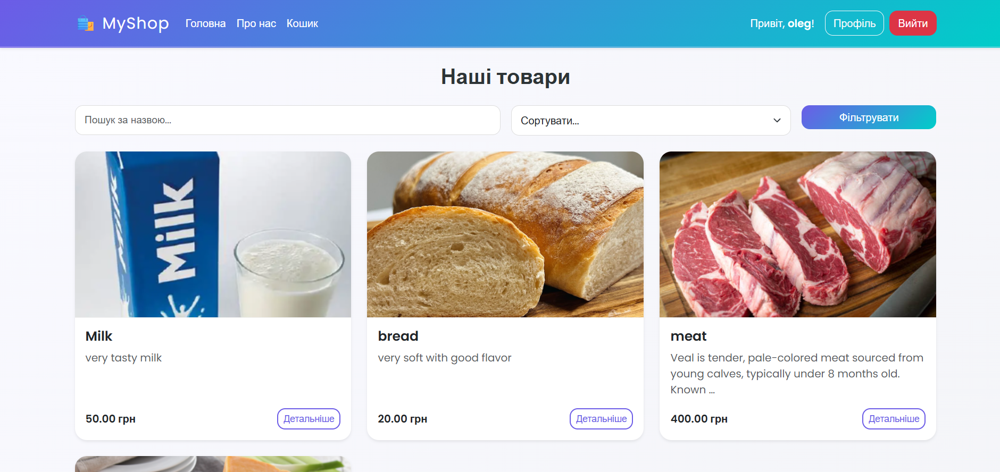
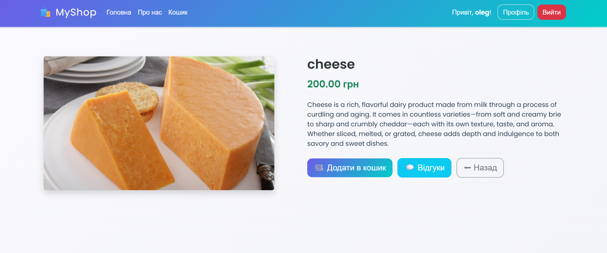
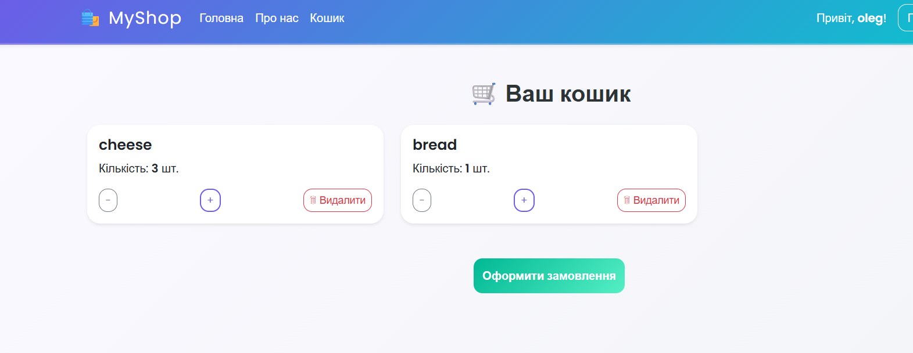
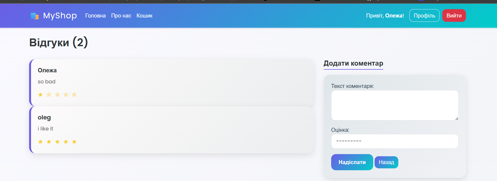
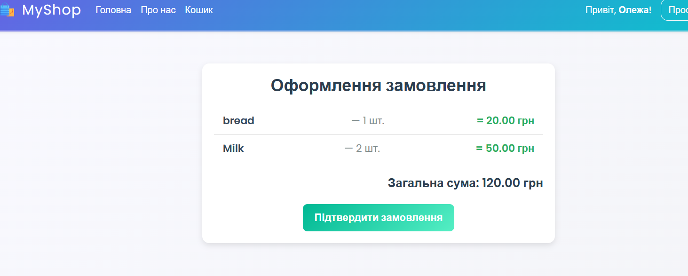

# 🛍️ MyShop - Інтернет-магазин

**MyShop** - це сучасний веб-додаток інтернет-магазину, розроблений на Django. Проект включає всі необхідні функції для ведення онлайн-торгівлі: від каталогу товарів до оформлення замовлень.

## 📋 Зміст

- [Особливості](#особливості)
- [Технології](#технології)
- [Структура проекту](#структура-проекту)
- [Інтерфейс](#інтерфейс)
- [Установка](#установка)
- [Використання](#використання)
- [Функціональність](#функціональність)

## ✨ Особливості

### 🔐 Система користувачів
- Реєстрація та авторизація
- Персональні профілі
- Система сесій

### 🛒 Каталог товарів
- Адаптивний дизайн карток товарів
- Пошук за назвою
- Сортування за ціною та рейтингом
- Детальні сторінки товарів

### 🛍️ Кошик покупок
- Додавання/видалення товарів
- Зміна кількості в реальному часі
- AJAX-оновлення без перезавантаження

### 📝 Система відгуків
- Коментарі з рейтингом (1-5 зірок)
- Ідентифікація авторів
- Підрахунок кількості відгуків

### 💳 Оформлення замовлень
- Перегляд товарів у замовленні
- Підрахунок загальної суми
- Підтвердження покупки

## 🛠️ Технології

### Backend
- **Django** - веб-фреймворк
- **Python** - основна мова програмування
- **SQLite/PostgreSQL** - база даних

### Frontend
- **HTML5** + **CSS3**
- **Bootstrap 5.3.3** - UI фреймворк
- **JavaScript** - інтерактивність
- **Google Fonts (Poppins)** - типографіка

### Безпека
- CSRF-захист
- Система автентифікації Django
- Валідація даних форм

## 📁 Структура проекту

```
MyShop/
├── main/                    # Головний додаток
├── basket/                  # Додаток кошика
├── comments/               # Система відгуків
├── users/                  # Управління користувачами
└── manage.py
```

## 🖼️ Інтерфейс

### Головна сторінка

Головна сторінка містить:
- Навігаційне меню з логотипом
- Форму пошуку та фільтрації
- Сітку товарів у вигляді карток
- Responsive дизайн для всіх пристроїв

### Сторінка товару

Детальна інформація включає:
- Великі зображення товару
- Повний опис та характеристики
- Кнопку додавання в кошик
- Секцію з відгуками

### Кошик покупок

Функціональність кошика:
- Список обраних товарів
- Контролери кількості (+/-)
- Кнопка видалення товару
- Перехід до оформлення

### Система відгуків


Можливості системи відгуків:
- Форма додавання коментаря
- Рейтингова система зірок
- Відображення всіх відгуків
- Ідентифікація авторів

### Оформлення замовлення

Етапи оформлення:
- Перегляд товарів у замовленні
- Підрахунок загальної суми
- Форма підтвердження
- Фінальне підтвердження покупки

## 🚀 Установка

### Вимоги
- Python 3.8+
- Django 4.0+
- Bootstrap 5.3.3

### Крок за кроком

1. **Клонування репозиторію**
```bash
git https://github.com/VieshchykovOleg/MyShop
cd shop
```

2. **Створення віртуального середовища**
```bash
python -m venv venv
source venv/bin/activate  # Linux/Mac
# або
venv\Scripts\activate     # Windows
```

3. **Установка залежностей**
```bash
pip install -r requirements.txt
```

4. **Міграція бази даних**
```bash
python manage.py makemigrations
python manage.py migrate
```

5. **Запуск сервера**
```bash
python manage.py runserver
```

Додаток буде доступний за адресою: `http://127.0.0.1:8000/`

## 📖 Використання

### Для покупців
1. **Реєстрація/Вхід** - створіть обліковий запис
2. **Перегляд товарів** - використовуйте пошук та фільтри
3. **Додавання в кошик** - оберіть потрібні товари
4. **Оформлення** - завершіть покупку

### Для адміністраторів
1. **Панель адміністрування** - `http://127.0.0.1:8000/admin/`
2. **Додавання товарів** - через Django Admin
3. **Управління користувачами** - модерація та підтримка
4. **Перегляд замовлень** - контроль продажів

## ⚙️ Функціональність

### Основні можливості

#### 🔍 Пошук та фільтрація
- Текстовий пошук за назвою товару
- Сортування за ціною (зростання/спадання)
- Сортування за рейтингом

#### 🛒 Управління кошиком
```javascript
// AJAX-оновлення кількості товарів
function updateCart(itemId, action) {
    fetch(`/cart/update/${itemId}/`, {
        method: 'POST',
        headers: {
            'X-CSRFToken': csrftoken,
            'Content-Type': 'application/x-www-form-urlencoded'
        },
        body: `action=${action}`
    })
    .then(res => res.json())
    .then(data => {
        // Оновлення інтерфейсу без перезавантаження
    });
}
```

#### ⭐ Рейтингова система
- 5-зіркова система оцінювання
- Візуальне відображення рейтингу
- Зв'язок з коментарями користувачів


### Безпека
- **CSRF-захист** для всіх форм
- **Аутентифікація** через Django Auth
- **Валідація** введених даних
- **Санітизація** користувацького контенту

## 🎨 Дизайн

### Кольорова схема
- **Основний**: Bootstrap-тема
- **Акценти**: Сині та зелені відтінки
- **Попередження**: Помаранчеві кнопки
- **Небезпека**: Червоні елементи

### UX-елементи
- 🛍️ Емодзі для покращення сприйняття
- ⚡ Швидкі AJAX-операції
- 🎯 Інтуїтивна навігація

## 📈 Можливості розширення

- **Платіжна система** - інтеграція з платіжними сервісами
- **Доставка** - розрахунок вартості доставки
- **Знижки** - система промокодів
- **Багатомовність** - додаткові мови
- **API** - REST API для мобільних додатків


## 📄 Ліцензія

Цей проект розповсюджується під ліцензією Creative Commons BY-NC 4.0. Дивіться файл `LICENSE` для детальної інформації.

## 👥 Автор

**Vieshchykov Oleg**

GitHub: [VieshchykovOleg](https://github.com/VieshchykovOleg)

