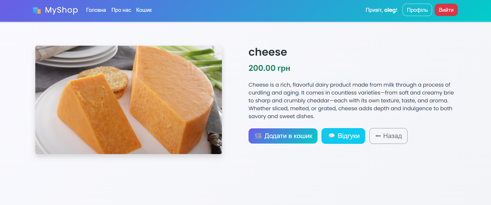
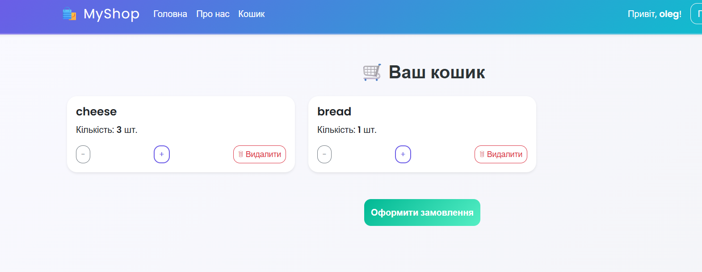
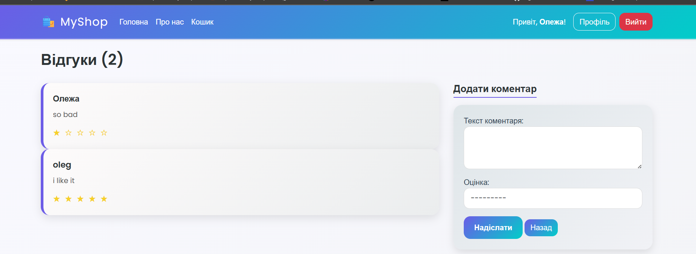
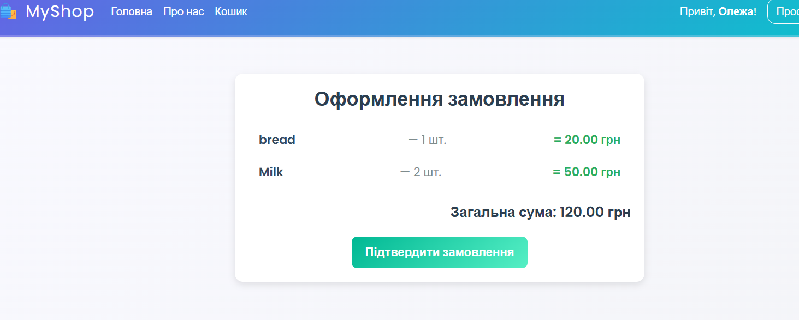

# 🛍️ MyShop - Online Store

**MyShop** is a modern online store web application developed with Django. The project includes all necessary features for online commerce: from product catalog to order processing.

## 📋 Table of Contents

- [Features](#features)
- [Technologies](#technologies)
- [Project Structure](#project-structure)
- [Interface](#interface)
- [Installation](#installation)
- [Usage](#usage)
- [Functionality](#functionality)

## ✨ Features

### 🔐 User System
- Registration and authentication
- Personal profiles
- Session system

### 🛒 Product Catalog
- Responsive product card design
- Search by name
- Sorting by price and rating
- Detailed product pages

### 🛍️ Shopping Cart
- Add/remove products
- Real-time quantity changes
- AJAX updates without page reload

### 📝 Review System
- Comments with rating (1-5 stars)
- Author identification
- Review count tracking

### 💳 Order Processing
- Order items overview
- Total amount calculation
- Purchase confirmation

## 🛠️ Technologies

### Backend
- **Django** - web framework
- **Python** - main programming language
- **SQLite/PostgreSQL** - database

### Frontend
- **HTML5** + **CSS3**
- **Bootstrap 5.3.3** - UI framework
- **JavaScript** - interactivity
- **Google Fonts (Poppins)** - typography

### Security
- CSRF protection
- Django authentication system
- Form data validation

## 📁 Project Structure

```
MyShop/
├── main/                    # Main application
├── basket/                  # Cart application
├── comments/               # Review system
├── users/                  # User management
└── manage.py
```

## 🖼️ Interface

### Home Page

The home page contains:
- Navigation menu with logo
- Search and filter form
- Product grid as cards
- Responsive design for all devices

### Product Page

Detailed information includes:
- Large product images
- Full description and specifications
- Add to cart button
- Reviews section

### Shopping Cart

Cart functionality:
- List of selected products
- Quantity controllers (+/-)
- Product removal button
- Proceed to checkout

### Review System


Review system capabilities:
- Comment form
- Star rating system
- Display of all reviews
- Author identification

### Order Processing

Processing steps:
- Order items overview
- Total amount calculation
- Confirmation form
- Final purchase confirmation

## 🚀 Installation

### Requirements
- Python 3.8+
- Django 4.0+
- Bootstrap 5.3.3

### Step by Step

1. **Clone Repository**
```bash
git clone https://github.com/VieshchykovOleg/MyShop
cd shop
```

2. **Create Virtual Environment**
```bash
python -m venv venv
source venv/bin/activate  # Linux/Mac
# or
venv\Scripts\activate     # Windows
```

3. **Install Dependencies**
```bash
pip install -r requirements.txt
```

4. **Database Migration**
```bash
python manage.py makemigrations
python manage.py migrate
```

5. **Run Server**
```bash
python manage.py runserver
```

The application will be available at: `http://127.0.0.1:8000/`

## 📖 Usage

### For Customers
1. **Registration/Login** - create an account
2. **Browse Products** - use search and filters
3. **Add to Cart** - select desired products
4. **Checkout** - complete purchase

### For Administrators
1. **Admin Panel** - `http://127.0.0.1:8000/admin/`
2. **Add Products** - through Django Admin
3. **User Management** - moderation and support
4. **View Orders** - sales control

## ⚙️ Functionality

### Main Features

#### 🔍 Search and Filtering
- Text search by product name
- Sort by price (ascending/descending)
- Sort by rating

#### 🛒 Cart Management
```javascript
// AJAX quantity updates
function updateCart(itemId, action) {
    fetch(`/cart/update/${itemId}/`, {
        method: 'POST',
        headers: {
            'X-CSRFToken': csrftoken,
            'Content-Type': 'application/x-www-form-urlencoded'
        },
        body: `action=${action}`
    })
    .then(res => res.json())
    .then(data => {
        // Interface update without reload
    });
}
```

#### ⭐ Rating System
- 5-star rating system
- Visual rating display
- Connection with user comments

### Security
- **CSRF protection** for all forms
- **Authentication** through Django Auth
- **Validation** of input data
- **Sanitization** of user content

## 🎨 Design

### Color Scheme
- **Primary**: Bootstrap theme
- **Accents**: Blue and green shades
- **Warning**: Orange buttons
- **Danger**: Red elements

### UX Elements
- 🛍️ Emojis to improve perception
- ⚡ Fast AJAX operations
- 🎯 Intuitive navigation

## 📈 Extension Possibilities

- **Payment System** - integration with payment services
- **Delivery** - delivery cost calculation
- **Discounts** - promo code system
- **Multilingual** - additional languages
- **API** - REST API for mobile applications

## 📄 License

This project is distributed under the Creative Commons BY-NC 4.0. See the `LICENSE` file for detailed information.

## 👥 Author

**Vieshchykov Oleg**

GitHub: [VieshchykovOleg](https://github.com/VieshchykovOleg)